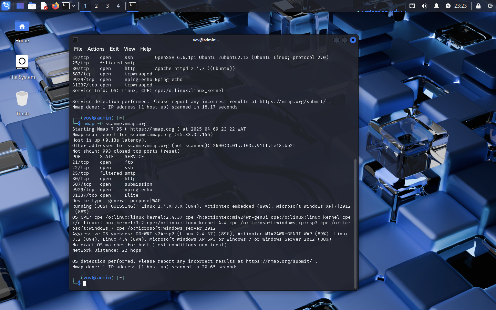

# 🌐 Nmap Website Scan Portfolio Project

This project demonstrates how to use **Nmap** for network reconnaissance and security testing on publicly accessible websites. The scan focuses on identifying:

- Open ports
- Running services and their versions
- Operating system fingerprinting

### Target Used:
- **scanme.nmap.org** (official Nmap test domain)

## Tools Used:
- **Nmap** (Network Mapper)
- **Linux Terminal** (Kali Linux)

## Screenshots

### 1. Service and Version Detection

### 2. Operating System Detection

---

## Detailed Report
Please refer to the (report.rtf) file for detailed findings and analysis.

